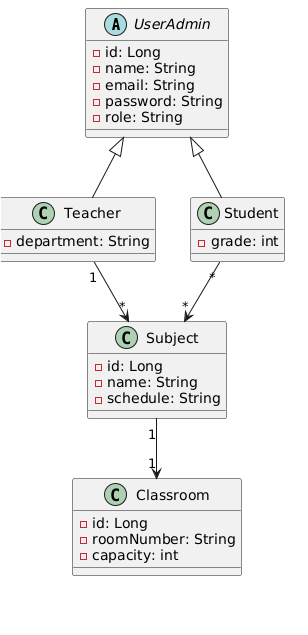

# IronSchool - Sistema Educativo con Spring Boot

  
  
  
  
  

> 📚 Un sistema educativo hecho con Spring Boot, MySQL, Lombok y autenticación JWT.

---

# IronSchool 🎓

## Descripción del proyecto
IronSchool es una API REST construida con Spring Boot para la gestión de un sistema escolar. Permite administrar usuarios (estudiantes, profesores, administradores), asignaturas y aulas, aplicando herencia con JPA y autenticación segura.

## Diagrama de clases

## Configuración
1. Clonar el repositorio:  
   `git clone https://github.com/Josemargal/IronSchool.git`
2. Configurar `application.properties` con tus credenciales MySQL.
3. Ejecutar con:  
   `mvn spring-boot:run`

## Tecnologías utilizadas
- Java 21
- Spring Boot + Spring Security
- JPA / Hibernate
- MySQL 8.0+
- Maven 3.8+
- Lombok 1.18+
- JWT (jjwt) 0.11.5
- Mockito

## Estructura de controladores y rutas
- `/api/users` → CRUD de usuarios
- `/api/classrooms` → Gestión de aulas
- `/api/subjects` → Gestión de asignaturas
- `/api/auth` → Registro y login con JWT

## Enlaces adicionales
- [Trello](https://trello.com/b/zmnIGeon/ironschool)
- [Presentación](https://tu-enlace-slides.com](https://www.canva.com/design/DAGnUrNjmgs/OPzWvHMt_hUq4IYy_vOZfw/view?utm_content=DAGnUrNjmgs&utm_campaign=designshare&utm_medium=link2&utm_source=uniquelinks&utlId=h47650c0149)

## Trabajo futuro
- Añadir tests unitarios
- Sistema de notas y asistencia
- Frontend con React
- Despliegue en la nube

## Recursos
- [Spring Boot Docs](https://spring.io/projects/spring-boot)
- [Spring Security](https://spring.io/guides/topicals/spring-security-architecture)
- [JPA/Hibernate](https://hibernate.org/orm/documentation/)

## Autor del proyecto
- [Jose Angel Martin](https://github.com/Josemargal)
- 
